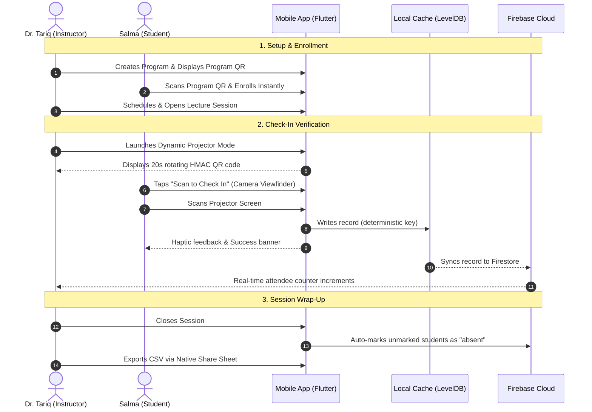

# 📱 Smart Attendance App
### *Enterprise-Grade, Offline-First Mobile Attendance & Verification System*

<p align="center">
  
  
  
  
  
  
  
  <a href="https://trello.com/b/Cju0jmDo/smart-attendance-app"></a>
</p>

---

## 🌟 Overview & Core Value Proposition

The **Smart Attendance App** is an offline-first mobile application built for educational institutions, academies, and technical bootcamps. It eliminates proxy attendance ("buddy punching") and classroom instructional time loss using **Ed25519 asymmetric cryptography** and **rotating dynamic projector tokens**.

```
┌────────────────────────────────────────────────────────────────────────┐
│                        CORE PILLARS OF THE SYSTEM                      │
├───────────────────┬─────────────────────┬──────────────────────────────┤
│  ⚡ ULTRA-FAST     │  🛡️ ANTI-FRAUD      │  📶 100% OFFLINE-READY       │
│  < 5s Check-in    │  Rotating 20s HMAC  │  Unlimited Firestore Cache   │
│  Per Student      │  Ed25519 Signatures │  Deterministic Sync Queue    │
└───────────────────┴─────────────────────┴──────────────────────────────┘
```

---

## 📸 Multi-Method Attendance Engine

The system provides three complementary verification methods tailored for any classroom condition:

| Method | Verification Flow | Security Mechanism | Best For |
| :--- | :--- | :--- | :--- |
| **Method A** <br>*(Instructor Scans Student)* | Student displays personal **"My QR"** badge; Instructor scans via **Scanner Tab**. | **Ed25519 Digital Signatures** + dynamic brightness boost. | Underground halls, low-connectivity rooms, door-check entrance. |
| **Method B** <br>*(Student Scans Instructor)* | Instructor presents **Projector Mode** on screen; Students tap **"Scan to Check In"**. | **Dynamic 20s rotating SHA-256 HMAC** with ±1 drift tolerance. | Large lecture halls (60–200+ students) in under 90 seconds. |
| **Method C** <br>*(Manual Roster & Batch)* | Instructor marks status on live roster; Imports cohorts via **Batch CSV Upload**. | Instructor audit logs with deterministic Firestore document keys. | Tardy excuses, roll-call disputes, and semester cohort onboarding. |

---

# 📑 STAGE 1 — Business Requirements Document (BRD)

### 1.1 The Business Problem
* **15% Instructional Waste:** Traditional roll-calls and paper signing sheets consume 10–20 minutes per 2-hour lecture.
* **Proxy Attendance Fraud:** Absent students have peers sign paper registers or forward static passcodes via messaging apps.
* **Campus Connectivity Blackouts:** Cellular dead-zones and overloaded Wi-Fi disrupt cloud-only attendance tools.
* **Delayed Interventions:** Absence ledgers remain uncompiled until end-of-term, preventing proactive student retention.

### 1.2 Measurable Business Objectives
* **`OBJ-01` (Velocity):** Reduce total check-in time to **< 5 seconds per student** (< 90 seconds for a 50-student lecture).
* **`OBJ-02` (Offline Continuity):** Achieve **100% check-in capability during offline network blackouts** with zero data loss.
* **`OBJ-03` (Fraud Elimination):** Mitigate remote buddy punching by **≥ 95%** using rotating dynamic HMAC tokens and Ed25519 signatures.
* **`OBJ-04` (Admin Reduction):** Cut attendance reporting and roster compilation effort by **≥ 80%** via automated CSV exports.

### 1.3 High-Level Business Requirements (BR)
* **`BR-01` (Role Isolation):** Strict segregation between Admin/Instructor and Student layouts via cryptographic role claims.
* **`BR-02` (Frictionless Enrollment):** Students enroll in programs via 6-character invite code or camera QR scan.
* **`BR-03` (Anti-Fraud Self Check-In):** In-class projector QR codes auto-refresh every 20 seconds; expired codes are rejected.
* **`BR-04` (Offline Resilient Scanning):** Instructors scan offline student badges with immediate local persistence and auto-sync queue.
* **`BR-05` (Deterministic Conflict Resolution):** Sync packets for the same session/student resolve idempotently to `${sessionId}_${studentId}`.
* **`BR-06` (Automated Absence Enforcement):** Closing a session automatically marks all unmarked enrolled students as `absent`.
* **`BR-07` (Executive KPI Visibility):** Real-time attendance percentage computation with automated at-risk alerts (< 80%).
* **`BR-08` (Native Interoperability):** Single-tap CSV generation with native device share sheet integration (Email, WhatsApp, Drive).
* **`BR-09` (Bilingual Cultural Parity):** Native hot-swappable dual-language support for Arabic (complete RTL) and English (LTR).

---

# 📋 STAGE 2 — Product Requirements Document (PRD)

### 2.1 User Personas & Target Audience
* **Dr. Tariq (Academy Instructor / Admin):** Manages bootcamps with 60+ students. Needs 1-tap projector mode, offline door scanning, and instant monthly CSV exports.
* **Salma (Bootcamp Student):** Enrolled in engineering programs. Needs camera self-check-in, offline identity badge, and real-time attendance rate tracking.

### 2.2 End-to-End In-Class Journey


### 2.3 Core Epics & Traceability Map
* **Epic 1: Identity, Roles & Session Guard (`AUTH`):** Multi-role auth, AutoRoute navigation guards, instructor invite code elevation. *(Traceable to: `BR-01`, `BR-09`)*
* **Epic 2: Programs & Course Management (`PROG`):** Program creation, 6-char codes, `PrettyQrView` program QR display, and camera scan-to-join. *(Traceable to: `BR-02`, `BR-09`)*
* **Epic 3: Sessions & State Machine (`SESS`):** Lifecycle management (`scheduled` → `open` → `closed`), late thresholds, and automated absence marking. *(Traceable to: `BR-03`, `BR-06`)*
* **Epic 4: Anti-Fraud Attendance Engines (`ATTD`):** Ed25519 token service, 20-second dynamic projector tokens, vector camera viewfinders (`ScannerOverlayPainter`). *(Traceable to: `BR-03`, `BR-04`, `BR-05`)*
* **Epic 5: Analytics, Reports & Native Sharing (`REPO`):** Executive KPI cards, at-risk flags (< 80%), native CSV export via `share_plus`. *(Traceable to: `BR-07`, `BR-08`)*
* **Epic 6: Localization & Cultural Parity (`I18N`):** Runtime hot-swapping between Arabic RTL (Cairo) and English LTR (Inter). *(Traceable to: `BR-09`)*

### 2.4 Canonical Firestore Schema Architecture
```
users/{uid}
  ├── email: string
  ├── name: string
  ├── role: "admin" | "student"
  └── updatedAt: timestamp

programs/{programId}
  ├── title: string
  ├── inviteCode: string (e.g. "FLT123")
  ├── instructorId: string
  ├── minAttendancePercent: number (e.g. 80)
  └── enrollments/{studentId}
        ├── studentId: string
        ├── studentName: string
        └── enrolledAt: timestamp

sessions/{sessionId}
  ├── programId: string
  ├── title: string
  ├── startTime: timestamp
  ├── lateThresholdMinutes: number (e.g. 15)
  ├── status: "scheduled" | "open" | "closed"
  └── secretToken: string (HMAC key)

attendance/{sessionId_studentId}
  ├── sessionId: string
  ├── programId: string
  ├── studentId: string
  ├── status: "present" | "late" | "absent" | "excused"
  ├── checkInMethod: "method_a" | "method_b" | "manual" | "auto_absent"
  ├── timestamp: timestamp
  └── isSynced: boolean
```

---

# 📌 STAGE 3 — Agile Project Management (Trello Board)

All **18 User Stories** across Sprints 1, 2, and 3 are mapped, tracked, and verified on the live Trello board:

* 🌐 **Live Trello Board:** [Smart Attendance App Workspace](https://trello.com/b/Cju0jmDo/smart-attendance-app)
* 📥 **Importable CSV Ledger:** [`docs_package/trello_import.csv`](docs_package/trello_import.csv) (18 User Stories ready for import)

### Sprint Mapping:
* **Sprint 1 (Foundations & Core Setup):** `US-1.1` to `US-1.6` (Multi-Role Auth, Program Creation, QR Display, Join Flow, RTL Arabic Localization)
* **Sprint 2 (Attendance & Cryptography):** `US-2.1` to `US-2.6` (Ed25519 Engine, Offline Badges, Dynamic Projector QR, Scanner Overlays)
* **Sprint 3 (Lifecycle, Analytics & Hardening):** `US-3.1` to `US-3.6` (Session Transitions, Auto-Absence, Roster Controls, Batch CSV, KPI Dashboards, Security Rules)

---

# 🏗️ Technical Architecture & Engineering

```
lib/
├── core/                         # Enterprise Infrastructure
│   ├── common/widgets/           # Atoms, Molecules, ScannerOverlayPainter, QrCard
│   ├── crypto/                   # QrTokenService (Ed25519 + SHA-256 HMAC)
│   ├── dependency_injection/     # Injectable + GetIt service locator
│   ├── languages/                # EasyLocalization tokens (ar-EG & en-US)
│   ├── routes/                   # AutoRoute configuration with session guards
│   └── theme/                    # AppColors, AppTypography, Design Tokens
│
├── features/                     # Feature-First Clean Architecture Slices
│   ├── admin/                    # Admin layout, scanner page, reports page
│   ├── attendance/               # AttendanceCubit, verification use-cases, overlays
│   ├── auth/                     # AuthCubit, Firebase Auth data-source, role elevation
│   ├── enrollment/               # EnrollmentCubit, CSV parser, student roster tiles
│   ├── programs/                 # ProgramsCubit, program QR display/scan sheets
│   ├── reports/                  # ReportsCubit, KPI calculator, native CSV exporter
│   ├── sessions/                 # SessionsCubit, dynamic projector mode sheet
│   └── student/                  # Student layout, offline QR card, self check-in scanner
```

---

# ⚡ Quick Start & Setup Guide

### 1. Prerequisites
* **Flutter SDK:** `^3.19.0` or higher
* **Dart SDK:** `^3.3.0` or higher
* **Android:** SDK Version ≥ 23 (Android 6.0+)
* **iOS:** iOS Version ≥ 13.0

### 2. Installation
```bash
# Clone the repository
git clone https://github.com/your-org/attendance_app.git
cd attendance_app

# Install Flutter dependencies
flutter pub get

# Generate Code (Dependency Injection & AutoRoute)
dart run build_runner build --delete-conflicting-outputs
```

### 3. Verify Code Quality & Test Suites
```bash
# Run static code analysis (0 warnings / 0 errors guaranteed)
flutter analyze

# Execute complete test suite (37/37 tests passing)
flutter test
```

### 4. Build & Launch
```bash
# Run in debug mode on connected device / emulator
flutter run

# Build Android Debug APK
flutter build apk --debug
```

---

# 📦 Project Deliverables Package

| Deliverable File | Direct Path | Purpose |
| :--- | :--- | :--- |
| **Complete Zip Archive** | [attendance_app_project_package.zip](file:///d:/Elevate/attendance_app/attendance_app_project_package.zip) | Bundled archive containing all specs, BRD, PRD, and Trello CSV. |
| **Stage 1 (BRD)** | [STAGE_1_BRD.md](file:///d:/Elevate/attendance_app/docs_package/STAGE_1_BRD.md) | Business Requirements Document and measurable KPIs. |
| **Stage 2 (PRD)** | [STAGE_2_PRD.md](file:///d:/Elevate/attendance_app/docs_package/STAGE_2_PRD.md) | Product Requirements Document, user stories, and acceptance criteria. |
| **Stage 3 (Live Trello Board)** | [Smart Attendance App Workspace](https://trello.com/b/Cju0jmDo/smart-attendance-app) | Live interactive Trello board tracking all 18 User Stories across Sprints 1–3. |
| **Stage 3 (Trello CSV)** | [trello_import.csv](file:///d:/Elevate/attendance_app/docs_package/trello_import.csv) | Direct-import CSV file for Trello (18 stories across 3 sprints). |
| **Engineering Walkthrough** | [WALKTHROUGH.md](file:///d:/Elevate/attendance_app/docs_package/WALKTHROUGH.md) | Technical verification report, test outputs, and architecture notes. |

---

<p align="center">
  <b>Smart Attendance App</b> • Built with ❤️ for educational excellence, offline resilience, and zero attendance fraud.
</p>
